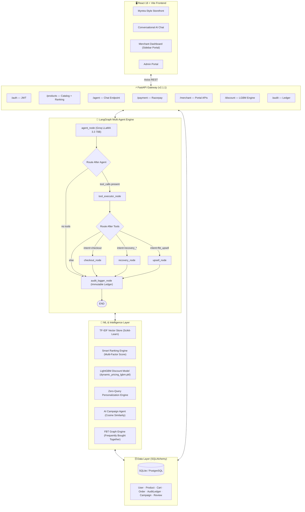
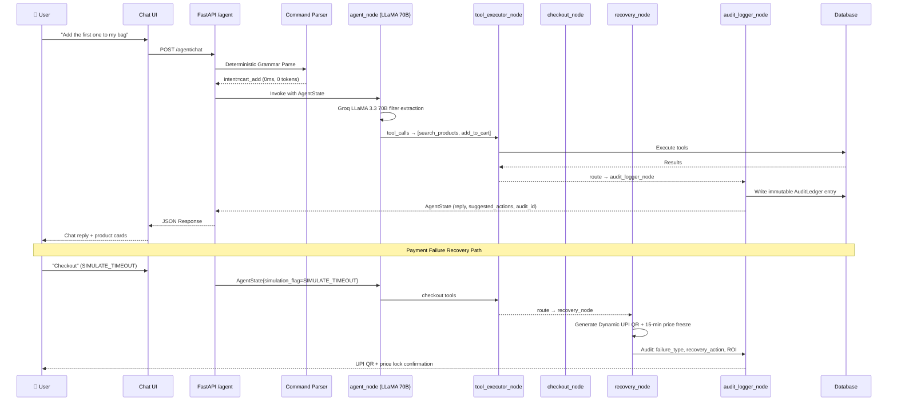

<div align="center">

# ⚡ RazorCartAI
### *Agentic AI E-Commerce Platform*

[](https://fastapi.tiangolo.com)
[](https://github.com/langchain-ai/langgraph)
[](https://groq.com)
[](https://vitejs.dev)
[](https://razorpay.com)

> **Every money action: explainable, bounded, and gated. Every decision: traceable to its audit entry.**

</div>

---

## 🏆 Hackathon Track — AI Growth & Agentic Commerce

RazorCartAI is a **production-grade agentic commerce system** where a LangGraph multi-agent orchestration engine drives the entire customer journey — from zero-query personalized discovery, through conversational cart negotiation, to autonomous payment failure recovery — with every financial action logged to an immutable Merchant Audit Ledger.

---

## 🧠 System Architecture



---

## 🔄 LangGraph Agent Flow — Request Lifecycle



---

## 🎯 The 10 Pillars — Implementation Deep-Dive

| # | Pillar | Implementation |
|---|--------|----------------|
| **1** | **E-Commerce Base** | Full CRUD catalog with 10,000+ products across Footwear, Apparel, Electronics & Mobile. Myntra-style UI with star badges (`4.6 ★ \| 94`), seller city dispatch tags, CLIP-verified product photography served locally (zero CDN dependency at demo time). |
| **2** | **Auth & User Tracking** | JWT authentication with city-aware user profiles (`Bengaluru`, `Mumbai`, `Delhi`). Tracks `search_history`, `viewed_product_ids`, `preferences`, and `vector_embedding` per user session. |
| **3** | **Zero-Query Personalization** | Composite user interest vector computed from search history + view history + preferences. On homepage load, generates a ranked personalized rail with no query required. Swap personas (Priya / Rahul) instantly via Chaos Center. |
| **4** | **AI Conversational Discovery** | LangGraph `agent_node` invokes Groq LLaMA 3.3 70B to extract structured filters (brand, gender, category, color, `max_price`, `min_rating`). Falls back to deterministic NLP heuristics with zero network dependency when offline. |
| **5** | **Smart Rating & Review Ranking** | Bayesian-inspired multi-factor score. With search: `0.80×SemanticSim + 0.12×RatingReviewScore + 0.08×CityBoost`. Browsing: `0.40×Sem + 0.35×Rating + 0.25×City`. Review confidence: `0.65 + 0.35×log(1+reviews)/log(250)`. |
| **6** | **FBT Complementary Pairing** | Graph-mapped Frequently Bought Together relationships. Running shoes → cushioned socks + sneaker cleaning kit + training bag. Recommended at catalog price via dedicated `upsell_node`. |
| **7** | **Conversational Checkout** | `checkout_node` generates live Razorpay Orders & hosted payment links directly inside the chat interface. Gated by explicit user confirmation (`pending_confirmation` state field — spend never executes without consent). |
| **8** | **Graceful Timeout Recovery** | `recovery_node` intercepts HTTP 504 gateway timeouts → generates Dynamic UPI QR code + 15-minute price freeze guarantee. Full recovery audit trail written to immutable Ledger with ROI calculation. |
| **9** | **Cart Negotiation (Insufficient Funds)** | On card decline / budget limit: agent identifies lowest-priority accessory in bag, proposes 1-click removal, recalculates total. Every negotiation step is gated and audited — zero silent mutations. |
| **10** | **Merchant Audit Ledger** | Immutable `AuditLedger` table records every money action: `reasoning`, `money_amount`, `profit_impact`, `failure_type`, `recovery_action`, `audit_id`. Displayed in Merchant Dashboard with revenue AreaCharts and recovery ROI stats. |

---

## 🤖 Agentic Intelligence — What Makes It Truly Agentic

### 1. Deterministic Command Grammar (Zero LLM Cost for Cart Ops)

Cart and order operations use a **compiled regex grammar** (`commands.py`) — a closed vocabulary of verbs over the agent's own numbered lists. This is a deliberate architectural choice:

```
"Add the first one to my bag"  →  intent=cart_add  (grammar, 0ms, 0 tokens)
"Find me pink running shoes"   →  intent=discovery  (LLM, ~200ms)
```

> *"The audit ledger records the pattern name that fired, so 'why did the agent change my cart' has a literal answer."*

### 2. Shared Agent State

Every node reads and writes a single typed `AgentState` (TypedDict) — the source of truth across the entire graph:

```python
class AgentState(TypedDict):
    intent: str                       # discovery | checkout | recovery_timeout | ...
    extracted_filters: Dict           # brand, gender, color, max_price, min_rating
    simulation_flag: Optional[str]    # SIMULATE_TIMEOUT | SIMULATE_INSUFFICIENT_FUNDS
    pending_confirmation: Optional[Dict]  # gated spend — must confirm before execution
    focus_list: List[Dict]            # "the 2nd one" resolves against this list
    audit_reasoning: str              # why the agent took this specific action
    money_amount: float               # tracked for ledger
    profit_impact: float              # tracked for merchant analytics
    client_action: Optional[Dict]     # SPA navigation instruction from server
```

### 3. AI Campaign Agent (Merchant Intelligence)

Merchants describe campaigns in plain English. The `CampaignAgent` pipeline:

```
Merchant Prompt → Groq LLM (intent parse + category extraction)
    → TF-IDF Vector Store (product matching, score > 0.1)
    → Cosine Similarity (user history vs. campaign keywords)
    → Segment: Dwellers (viewed exact products) + Explorers (category affinity)
    → Personalized Offers + Predicted Conversion Uplift %
```

**Dwellers** → users who viewed matched products → *"Have a second look at a better price"*  
**Explorers** → users with keyword/category affinity → *"Lightning deals in your interest area"*

### 4. LightGBM Dynamic Discount Engine

A trained **LightGBM model** (`dynamic_pricing_lgbm.pkl`) evaluates 15 behavioral signals to recommend optimal discount percentages, bounded by per-category merchant guardrail policies:

| Category | Max Discount | Bulk Bonus | Policy |
|----------|-------------|------------|--------|
| Smartphones | 12% | +5% | Electronics Standard Margin |
| Footwear | 20% | +5% | Footwear Margin Protection |
| Fashion / Apparel | 25% | +10% | Apparel Margin (high volume) |
| Electronics | 15% | +5% | Consumer Electronics |

**15 Input Features:** `discount_offered`, `target_item_view_count`, `target_item_dwell_seconds`, `cart_addition_flag`, `time_in_cart_minutes`, `category_dwell_ratio`, `alternative_product_views`, `historical_cat_conversion`, `discount_affinity_ratio`, `days_since_last_purchase`, `cat_cart_abandonment_ratio`, `cart_value`, `cart_item_count`, `product_price`, `profit_margin_pct`

---

## 🏪 Merchant Portal

The full-featured **Merchant Portal** (`/merchant/dashboard`) features a persistent sidebar layout:

```
Sidebar Navigation
├── 📊  Home          — Revenue/Profit AreaChart + KPI stat cards (Orders, GMV, Avg Order Value)
├── 📦  Products      — Full inventory management (add / edit / delete / image upload)
├── 🎯  AI Campaigns  — Plain-English campaign creation with AI user segmentation
├── 💸  Discounts     — LightGBM-powered dynamic pricing optimizer
├── 📋  Orders        — Order management and fulfillment tracking
├── 📈  Audit Ledger  — Immutable AI decision trail with money action history
└── 👤  Profile       — Store identity, verification badge, stats & sign-out
```

---

## 🛠️ Tech Stack

| Layer | Technology | Purpose |
|-------|-----------|---------|
| **Frontend** | React 18, Vite, Tailwind CSS | Storefront & merchant portal UI |
| **Charts** | Recharts (AreaChart, BarChart) | Revenue / profit visualization |
| **Backend** | FastAPI 2.1.1, Python 3.12 | 11-router REST API |
| **ORM / DB** | SQLAlchemy, SQLite / PostgreSQL | 7 data models |
| **AI Orchestration** | LangGraph, LangChain | Multi-agent state machine |
| **LLM** | Groq API — `llama-3.3-70b-versatile` | NL understanding & reasoning |
| **Vector Search** | Scikit-Learn TF-IDF | Semantic product retrieval |
| **ML Pricing** | LightGBM | Dynamic discount optimization |
| **Payments** | Razorpay Python SDK | Orders, hosted links, UPI QR |
| **Image Pipeline** | CLIP-verified WebP | Zero CDN dependency |
| **Auth** | JWT Bearer | Role-based access (customer / merchant / admin) |

---

## 🚀 Getting Started

### Prerequisites

- Python 3.12+ · Node.js 18+
- Free [Groq API Key](https://console.groq.com) *(optional — heuristic fallback works offline)*

### 1. Backend

```bash
cd backend
copy .env.example .env        # Add GROQ_API_KEY=gsk_... (optional)
pip install -r requirements.txt
uvicorn app.main:app --reload --port 8000
```

- **Swagger UI:** `http://localhost:8000/docs`

### 2. Frontend

```bash
cd frontend
npm install
npm run dev
```

- **Storefront:** `http://localhost:5173`
- **Merchant Portal:** `http://localhost:5173/merchant/login`
- **Admin Portal:** `http://localhost:5173/admin/login`

### 3. Demo Credentials

| Role | Email | Password |
|------|-------|----------|
| Customer — Priya (Bengaluru) | `priya@example.com` | `password123` |
| Customer — Rahul (Mumbai) | `rahul@example.com` | `password123` |
| Merchant | `merchant@demo.com` | `merchant123` |
| Admin | `admin@razorcart.ai` | `admin123` |

---

## 🧪 Chaos Center — Live Judge Controls

The floating **⚡ Chaos Center** widget (bottom-left) lets judges trigger all key agentic capabilities without any scripting:

| Trigger | What It Demonstrates |
|---------|----------------------|
| 🏃 **Switch → Priya (Bengaluru)** | Zero-query feed re-ranks on her composite vector + Bengaluru seller proximity boost |
| 👟 **Switch → Rahul (Mumbai)** | Personalized rail shifts to his viewed products + Mumbai city boost |
| ⚡ **Trigger 504 Timeout** | Intercepts gateway failure → Dynamic UPI QR → 15-min price freeze → Ledger entry |
| 💳 **Trigger Card Decline** | Agent identifies lowest-priority accessory → proposes 1-click cart pruning → gated confirmation |
| 🛡️ **Open Merchant Audit Ledger** | Live dashboard: revenue AreaChart + recovery ROI + AI decision step logs |

---

## 🔒 Security & Auditability Guarantees

- **Gated Money Actions** — No spend executes without `pending_confirmation` being explicitly resolved.
- **Immutable Audit Trail** — `AuditLedger` entries are append-only: `reasoning`, `failure_type`, `recovery_action`, `money_amount`, `profit_impact`, `audit_id`.
- **Role-Based Access** — All merchant and admin routes are JWT role-guarded. Customer tokens cannot reach merchant APIs.
- **Explainable Grammar** — Command parser records the exact regex pattern that fired. *"Why did the agent change my cart?"* → `CART_ADD_ORDINAL_PATTERN`. Literal answer, always.

---

## 📁 Project Structure

```
RazorCartAI/
├── backend/
│   ├── app/
│   │   ├── agents/
│   │   │   ├── graph.py                 # LangGraph StateGraph topology
│   │   │   ├── state.py                 # AgentState TypedDict (shared truth)
│   │   │   ├── commands.py              # Deterministic cart command grammar
│   │   │   ├── groq_llm.py              # Groq client + heuristic fallback
│   │   │   ├── tools_schema.py          # Tool definitions for LLM binding
│   │   │   └── nodes/
│   │   │       ├── agent_node.py        # LLM reasoning + tool selection
│   │   │       ├── tool_executor_node.py
│   │   │       ├── checkout_node.py     # Razorpay order generation
│   │   │       ├── recovery_node.py     # Timeout / funds failure recovery
│   │   │       ├── upsell_node.py       # FBT recommendation engine
│   │   │       ├── cart_ops.py          # Cart & order mutation handlers
│   │   │       ├── discovery.py         # Semantic search + ranking
│   │   │       ├── router.py            # Intent routing logic
│   │   │       └── audit_logger.py      # Immutable ledger writer
│   │   ├── models/
│   │   │   ├── user.py · product.py · cart.py
│   │   │   ├── order.py · audit_ledger.py
│   │   │   ├── review.py · campaign.py
│   │   ├── routers/                     # 11 FastAPI routers
│   │   ├── services/
│   │   │   ├── campaign_agent.py        # AI campaign segmentation
│   │   │   ├── discount_engine.py       # LightGBM pricing optimizer
│   │   │   ├── vector_store.py          # TF-IDF semantic search
│   │   │   ├── ranking.py               # Multi-factor ranking formula
│   │   │   ├── personalization.py       # Zero-query user vectors
│   │   │   ├── fbt_engine.py            # Frequently Bought Together
│   │   │   └── razorpay_service.py      # Payment SDK integration
│   │   └── ml/
│   │       └── dynamic_pricing_lgbm.pkl # Trained LightGBM model
│   └── static/products/                 # CLIP-verified local product images
└── frontend/
    └── src/
        ├── pages/
        │   ├── LandingPage.jsx           # Personalized storefront
        │   ├── ProductDetailPage.jsx     # Product + FBT recommendations
        │   ├── CartPage.jsx              # Cart with AI negotiation UI
        │   └── merchant/
        │       └── MerchantDashboard.jsx # Full merchant portal
        └── components/
            ├── Navbar.jsx                # Role-aware navigation
            └── CampaignBanner.jsx        # AI campaign display
```

---

<div align="center">

Built for the **Razorpay AI Hackathon** · Track: *AI Growth & Agentic Commerce*

</div>
